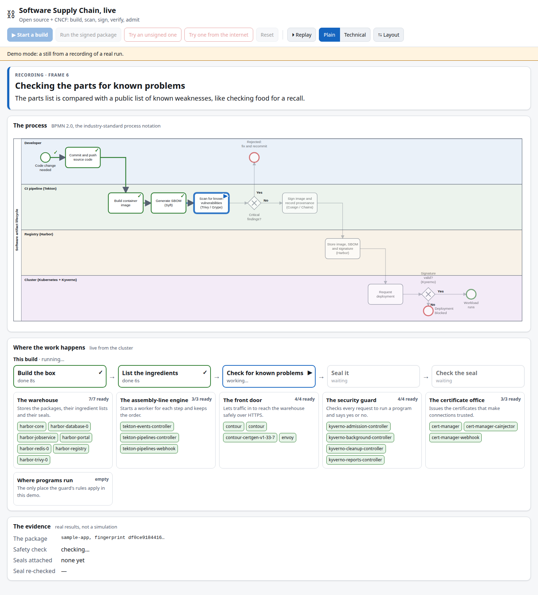
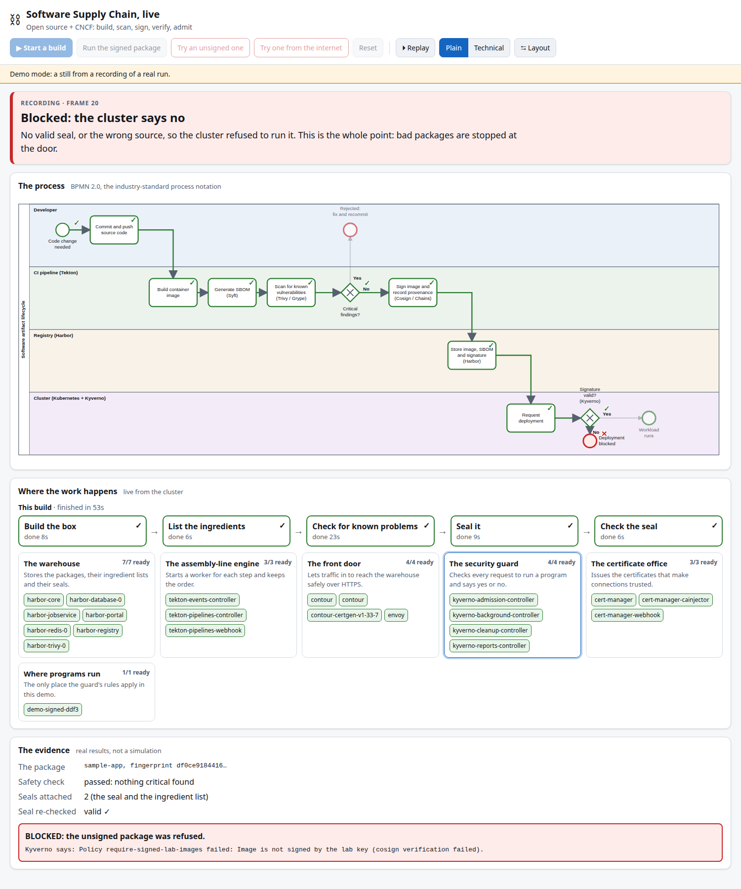
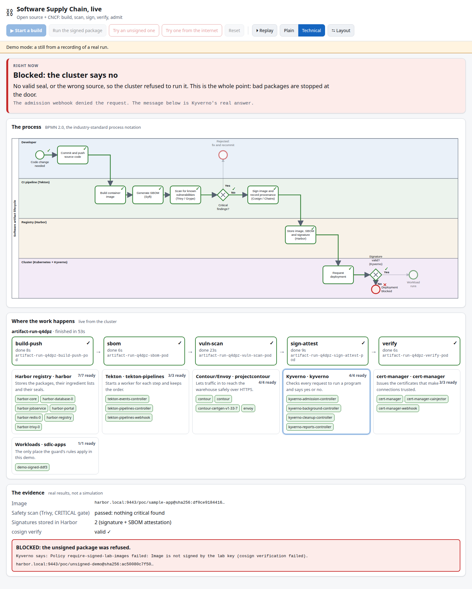
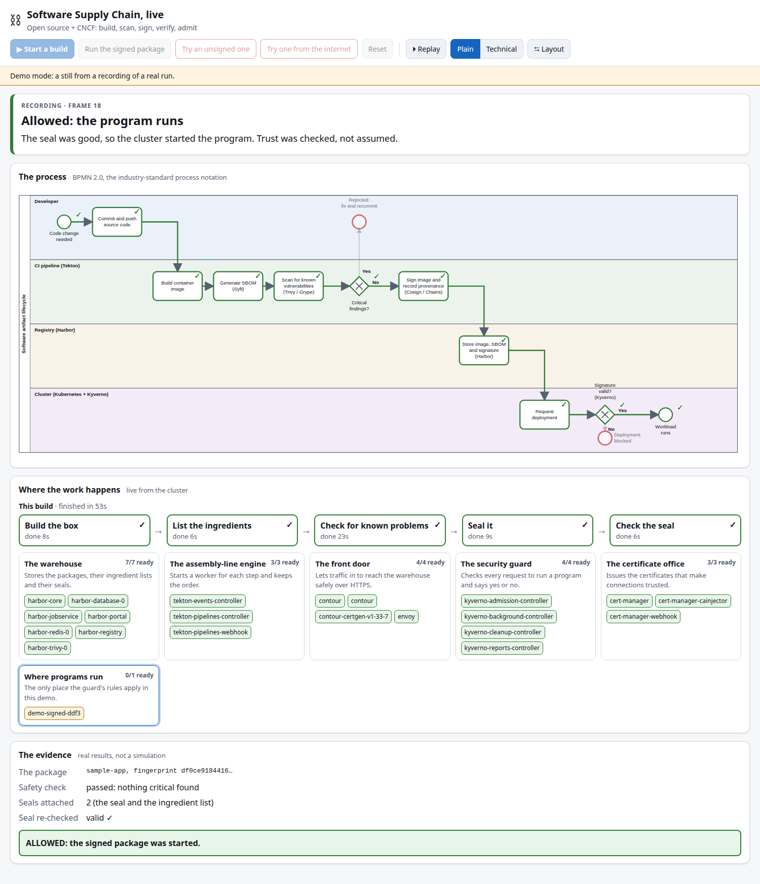

# Software Supply Chain POC

*A beginner's guide to building and securing software artefacts with open source*

---

Picture a shop shelf. One jar of food has a broken seal. Nobody asks who opened it, or when. The shop simply refuses to sell it.

Software has no such shop. A program is built by one machine, stored by another and run by a third. Every hand-off is a chance for something to change, and most of the time nobody checks.

This project is a small, working lab that fixes that. It takes a piece of software from a developer's keyboard to a running system and makes the chain prove itself at each step. It lists what is inside, checks it for known problems, seals it, files it, and then lets the cluster refuse anything that cannot show a valid seal.

> *Trust is not assumed. It is checked, every time, by a machine.*

That is the whole argument. The rest of this page explains how, one idea at a time.

Everything here is open source, and most of it comes from the CNCF, the Cloud Native Computing Foundation, the community home of Kubernetes [1]. You do not need to be an expert. Read the sections in order. Each one uses the one before.



*The lab in motion. The process (top) and the machinery doing the work (bottom) move together. See "Watch it run" below.*

---

## The sealed jar

Go back to the jar.

- The label tells you what is inside.
- A tamper seal tells you nobody opened it after it left the factory.
- A batch code tells you where and when it was made.
- The shop refuses a jar with a broken seal.

Software needs the same four things. This project builds them:

| Food jar | Software equivalent | In this project |
|---|---|---|
| Ingredient list | SBOM (Software Bill of Materials) | Syft |
| Safety inspection | Vulnerability scan | Trivy, Grype |
| Tamper seal | Digital signature | Cosign |
| Batch code and factory record | Provenance (how and where it was built) | Tekton (Chains planned) |
| Warehouse | Registry | Harbor |
| Shop that checks the seal | Admission policy | Kyverno |

---

## Words you will meet

| Word | Plain meaning |
|---|---|
| **Artefact** | Anything the build produces and we ship: a container image, a package, a Helm chart. |
| **Container image** | A sealed bundle of a program plus everything it needs to run. |
| **Registry** | A warehouse that stores and serves images. |
| **Digest** | A fingerprint of an image. Change one byte and the fingerprint changes. |
| **SBOM** | A list of every part inside the software. |
| **Vulnerability (CVE)** | A publicly known weakness in a part. |
| **Signature** | A mathematical seal. It proves who approved an artefact and that it has not changed. |
| **Provenance** | A record of how, where and from what source an artefact was built. |
| **Pipeline** | An automatic assembly line that builds and checks software. |
| **Kubernetes cluster** | A system that runs containers for us. |
| **Admission policy** | A rule the cluster checks before it lets something run. |

---

## Why attackers target the chain

Attackers often skip the front door. They do not break into a finished system. They slip something into a part the system already trusts: a library, a build machine, an image.

Three questions defend against that:

1. **What is in it?** An SBOM and a scan answer this.
2. **Who made it, and how?** Provenance and signatures answer this.
3. **Is it the same thing that was approved?** Digests and a check at deploy time answer this.

The rest of the project answers those three questions with working tools.

---

## The process at a glance

The diagram uses **BPMN 2.0**, Business Process Model and Notation, an open standard for drawing processes, maintained by the Object Management Group [5]. Read it left to right. Each row, called a lane, is one actor. Circles mark where the process starts and ends. Rounded boxes are steps. A diamond with a cross is a yes-or-no decision.


The editable source is [`docs/artifact-lifecycle.bpmn`](docs/artifact-lifecycle.bpmn). Any BPMN 2.0 tool can open it.

### The steps in plain English

1. **Commit and push source code.** A developer saves a change. The process starts.
2. **Build container image.** The pipeline packs the program into an image.
3. **Generate SBOM.** A tool lists every part inside the image.
4. **Scan for known vulnerabilities.** Another tool checks that list against known weaknesses.
5. **Critical findings? (decision).** If it finds a serious weakness, the build stops and goes back to the developer. This is "shift left": find problems early, while they are cheap to fix.
6. **Sign the image and record provenance.** If it passes, the pipeline seals the image and records how it was built.
7. **Store in the registry.** Harbor keeps the image, its SBOM and its signature together.
8. **Request deployment.** Someone asks the cluster to run the image.
9. **Signature valid? (decision).** The cluster checks the seal. A valid seal means the workload runs. A missing or broken seal means the deployment is blocked.

The lesson sits in steps 6 and 9. We sign in one place and verify in another. A tampered image is stopped even if it reaches the registry.

---

## Watch it run

A diagram explains a process. It does not show one happening. So the project ships a live view that puts the process and the machinery side by side and keeps them in step.

At the top, the BPMN diagram lights up as each step starts, finishes or fails, and a small token travels along the flow. Underneath, the cluster shows the real pods doing the work, grouped as a warehouse, an assembly-line engine, a front door and a security guard. Click a step and the matching pod highlights. A caption says in plain words what is happening and why it matters.



*The moment that matters. An unsigned package is refused at the door, and the message is the cluster's real answer.*

### Two ways to try it

**Live, against your own lab.** Build the lab (see "Try it yourself"), then run:

```bash
scripts/bootstrap.sh ui
```

Open `http://localhost:8099`. Press **Start a build** and watch. When it finishes, press **Run the signed package**, then **Try an unsigned one**.

**Without a cluster.** The page can replay a recording of a real run. From the repository root:

```bash
python3 -m http.server 8000 --bind 127.0.0.1
```

Open `http://localhost:8000/ui/`. The action buttons are switched off, because there is nothing live to act on. The recording loops, so you can watch the whole story.

### Made for a mixed audience

- **Plain** mode speaks in everyday words: the box, the seal, the guard.
- **Technical** mode adds the real names: pods, digests, policies and the exact message Kyverno returned.
- **Layout** switches between stacked and side by side.



*Same moment, technical mode.*

### What is real, and what is not

- **Real:** every state you see is read from the Kubernetes API. The scan result, the signatures and the denial message come from the actual tools.
- **Simulated:** "Commit and push" is triggered by the Start button, not by a real `git push`. Wiring a Git webhook is a later step.
- **Safe by design:** the server listens on your own machine only. It can read the cluster and run three fixed demo actions: start a build, start a test pod (signed, unsigned or from the internet) and remove the test pods. It can do nothing else. Each action needs a per-session token and a matching host name. No password or key ever reaches the browser.

---

## How this lines up with industry standards

We did not invent this process. It follows published guidance. We read the primary sources for the points below (see "Evidence and open flags").

**NIST SP 800-218, the Secure Software Development Framework (SSDF), version 1.1** [2]. It groups good practice into four areas: Prepare the Organization (PO), Protect the Software (PS), Produce Well-Secured Software (PW) and Respond to Vulnerabilities (RV).

**SLSA v1.0**, Supply-chain Levels for Software Artifacts [3]. Its Build track describes growing trust. Level 0 gives no guarantees. Level 1 means provenance exists. Level 2 means a hosted build platform generates and signs the provenance. Level 3 means a hardened build platform gives strong protection against tampering.

**CNCF Cloud Native Security Whitepaper, version 2.0** [4]. It describes four lifecycle phases: Develop, Distribute, Deploy and Runtime.

Our own mapping of project steps to those ideas is below. It is our reading, not an official table.

| Project step | SSDF area | CNCF phase | SLSA idea |
|---|---|---|---|
| Build in a pipeline | Produce Well-Secured Software | Develop / Distribute | Hosted build platform (aiming at Build L2) |
| SBOM and scan | Produce Well-Secured Software | Distribute | n/a |
| Sign and record provenance | Protect the Software | Distribute | Provenance exists and is signed |
| Store in registry | Protect the Software | Distribute | n/a |
| Verify before run | Protect the Software | Deploy | The consumer checks the provenance or signature |
| Rescan over time | Respond to Vulnerabilities | Runtime | n/a |

We are **aiming for** SLSA Build L2. We have not claimed or audited any level.

---

## The open source toolbox

Every tool below is open source. The foundation status comes from the CNCF projects page, read on 4 October 2026 [1]. Where a tool is not listed there, we make no claim.

| Job | Tool | What it does | CNCF status |
|---|---|---|---|
| Run containers | Kubernetes (`kind` for local use) | The platform everything runs on | Graduated |
| Build and automate | Tekton | The assembly line | Incubating |
| Store artefacts | Harbor | A registry with scanning support | Graduated |
| Route web traffic | Contour | Lets us reach services in the cluster | Incubating |
| Certificates | cert-manager | Creates and renews TLS certificates | Graduated |
| Enforce rules | Kyverno | Blocks unsigned or non-compliant workloads | Graduated |
| SBOM | Syft | Lists what is inside an image | Not shown on that page |
| Vulnerability scan | Trivy, Grype | Finds known weaknesses | Not shown on that page |
| Sign and verify | Cosign | Seals and checks artefacts | Not shown on that page |
| Move OCI artefacts | ORAS | Pushes non-image files to a registry | Not shown on that page |
| Check configuration | kubeconform, Checkov | Catches mistakes in Kubernetes files | Not shown on that page |
| Live view | This project's own page | Shows the process and the cluster together | Plain HTML and JavaScript, no framework |

Why open source? You can read the code, run it on your own laptop and swap any part later without being locked in.

---

## Where the project stands

| Piece | State |
|---|---|
| Local Kubernetes cluster (`kind`) | Running |
| Tekton Pipelines | Running |
| Contour ingress | Running, tested end to end |
| cert-manager and a local certificate authority | Running |
| Harbor registry over HTTPS | Running, all components healthy |
| Pipeline: build, SBOM, scan, sign, verify | **Working** |
| Kyverno: the cluster refuses unsigned images | **Working** in the `sdlc-apps` namespace |
| Live view of the process and the cluster | **Working**, live and as a recorded demo |
| Tidy-up sweep for stale and temporary items | **Working** |
| Tekton Chains (automatic provenance) | Planned |

The pipeline builds an image inside the cluster, lists it, scans it, signs it with a key, stores it in Harbor with its signature and SBOM, and verifies it. We also tested the "no" cases. Verification fails with the wrong key and fails for an image that was never signed.

The cluster now says no on its own. In the `sdlc-apps` namespace, Kyverno checks every new pod. A signed image from the lab registry is **admitted and runs**. An unsigned image is **denied** with the message `Image is not signed by the lab key`. An image from anywhere else, such as Docker Hub, is **denied** with `Images must come from harbor.local:9443/poc/`. The `admission` stage runs all three checks and fails loudly if any of them behaves differently.

Three trade-offs to know about:

- The policy covers only the `sdlc-apps` namespace, on purpose. A lab rule must never block the cluster's own components. Widening it is a deliberate later step.
- Signing uses a plain key with no public transparency log. That suits a private lab. It gives less public accountability than keyless signing.
- Tekton Chains, which records provenance automatically, is not built yet.

---

## What you need to run it

This lab runs a small data centre on one computer: a Kubernetes cluster, a registry, a build system and a security scanner. That takes real resources.

| Resource | Minimum | Recommended | Measured on the author's workstation |
|---|---|---|---|
| CPU cores visible to Docker | 4 | 6 or more | 8 cores; about a third of one core in use after a run |
| RAM available to Docker | 6 GiB | 10 GiB or more | About 2.6 GiB in the cluster node after a run (one reading) |
| Free disk for Docker data | 20 GiB | 30 GiB or more | About 9 GB of images and layers after one run |
| Internet | Required | A fast connection | The first run downloads many images and a vulnerability database |

The measured column is one machine: an 8-core Linux workstation, on 4 October 2026. The minimum and recommended values are our estimates with a safety margin `[EVIDENCE-FLAG]`. We have not tested a smaller machine. On 4 cores and 6 GiB, expect it to be slow.

Other requirements:

- **Operating system.** Tested on Linux. Not tested on macOS or Windows. With Docker Desktop, raise the virtual machine's memory first. The script checks what Docker can use, not what the laptop has.
- **Software.** Docker, `kind`, `kubectl`, `helm`, `cosign`, `curl` and `python3`. Tested with Docker 29.8 and `kind` 0.25.0.
- **Ports.** Host ports `8088` and `9443` must be free. The live view uses `8099`.
- **Internet access** to these sites: `registry-1.docker.io`, `ghcr.io`, `quay.io`, `gcr.io`, `registry.k8s.io`, `helm.goharbor.io`, `charts.jetstack.io`, `infra.tekton.dev` and `raw.githubusercontent.com`.
- **Permissions.** No `sudo` or administrator rights. You do need permission to use Docker.

### The script checks for you

Before it deploys anything, `scripts/bootstrap.sh` checks CPU, RAM, free disk, free ports and internet access. It stops with a clear message if the machine is too small, and warns if it only meets the minimum.

```bash
scripts/bootstrap.sh check
```

You can change the limits at your own risk, for example `MIN_RAM_GB=4`, or skip the check with `SKIP_RESOURCE_CHECK=1`.

---

## Try it yourself

```bash
# 1. Check your machine is big enough (changes nothing)
scripts/bootstrap.sh check

# 2. Build everything and run the demo pipeline (safe to re-run)
scripts/bootstrap.sh all

# 3. Watch it (optional, in its own terminal)
scripts/bootstrap.sh ui
```

The script is **idempotent**. Running it again repeats or repairs steps without breaking what already works. You can also run one stage at a time: `cluster`, `platform`, `harbor`, `node-trust`, `pipeline`, `kyverno`, `demo`, `admission`, `negative` or `ui`.

When it finishes you should see all five pipeline tasks marked `Succeeded`: `build-push`, `sbom`, `vuln-scan`, `sign-attest` and `verify`. The `admission` stage then tries to start three pods. It expects the signed image **admitted**, an unsigned image **denied** and a public Docker Hub image **denied**.



*The other half of the proof: a signed package is allowed through.*

To open the registry in a browser, add this line to your hosts file. It is the one step that needs administrator rights, and the script never does it for you:

```text
127.0.0.1 harbor.local
```

Then open `https://harbor.local:9443`. Your browser will warn about the certificate, because the lab makes its own certificate authority. That is expected. The admin password is generated on your machine and saved in `infra/harbor/.harbor-admin`, which stays out of version control.

**Never reuse the lab's passwords or keys anywhere real.** Everything is generated fresh on your machine. Secrets stay out of this repository on purpose.

**Tested from a blank state.** We deleted the cluster and every generated file, then ran `scripts/bootstrap.sh all`. It finished without errors in about 6.5 minutes on the workstation above, with a fast connection and the cluster's base image already downloaded. A first-ever run will take longer. This was one run on one machine. We have not tested macOS, Windows, a smaller machine or an empty image cache.

### Cleaning up after yourself

A lab leaves things behind: old pipeline runs, test pods, storage volumes and old image versions in the registry. The tidy-up sweep removes only stale or temporary items, and never deletes anything unless you say so.

```bash
scripts/bootstrap.sh tidy                 # dry run: lists what would be removed, deletes nothing
scripts/bootstrap.sh tidy --apply         # removes what the list showed
scripts/bootstrap.sh tidy --apply --deep  # also frees disk (images download again next time)
```

| Where | What counts as stale |
|---|---|
| Build system (Tekton) | Pipeline runs older than the newest 3 (their pods and volumes go with them), one-off test runs, unused volumes |
| Cluster | Finished test pods with no owner, demo pods left in `sdlc-apps` |
| Registry (Harbor) | Old untagged image versions beyond the newest 3 per repository |
| `--deep` only | Harbor garbage collection, unused Docker images on your computer, unused images inside the cluster node |

It never touches tagged registry images, the signing key, passwords or the running platform. Change the limits with, for example, `KEEP_RUNS=5 KEEP_ARTIFACTS=5 scripts/bootstrap.sh tidy`.

---

## Let an AI assistant build it for you

You can point an AI coding tool at this repository and let it set up the lab and run the example. The file [`AGENTS.md`](AGENTS.md) is written for AI tools. It states the goal, the exact commands, what success looks like and the rules to follow.

1. Clone the repository and open it in your AI tool: Claude Code, Codex, Cursor or any tool that reads `AGENTS.md`.
2. Give it this prompt:

   > Read AGENTS.md in this repository and follow it. Check my machine's resources first, tell me the result, and only then set up the lab. Run the demo pipeline and show me the evidence that it worked. Do not run anything with sudo. Ask me before anything destructive.

3. Look for the evidence it should show: the resource check result, five pipeline tasks `Succeeded`, three admission PASS lines, and the `negative` listing with one artefact that has no signatures.

A good assistant stops and asks you to run any privileged command yourself. That is the intended behaviour.

> **A safety note.** An AI tool runs commands on your computer. Read what it plans to do, keep it away from real credentials, and run this lab on a machine or account where you are happy to experiment.

---

## Evidence and open flags

A claim in this page is one of three kinds.

**Read from a primary source on 4 October 2026.**
- The four SSDF practice-group names, read from the text of NIST SP 800-218 [2].
- The SLSA v1.0 Build track levels, read on slsa.dev [3].
- The four CNCF lifecycle phases, read from the whitepaper [4].
- Each tool's CNCF status, read from the CNCF projects page [1].

**Measured by the author, once, on one machine.**
- The memory, disk and CPU readings, and the 6.5-minute blank-state run.

**Estimates and open flags.**
- `[EVIDENCE-FLAG]` The minimum and recommended resource figures are estimates. No smaller machine has been tested.
- `[EVIDENCE-FLAG]` Behaviour on macOS, Windows and an empty image cache is untested.
- The mapping of project steps to SSDF, CNCF and SLSA is the author's reading, not an official table.
- No SLSA level has been claimed or audited.
- For tools the CNCF page does not list, no foundation claim is made.

---

## Close

The lab proves one thing. A cluster can refuse what it cannot verify, and it can do so without a person watching.

Three steps push the same idea further. Tekton Chains will record provenance automatically, so the factory record is written by the machine and not by memory. The guard's rules will widen beyond one namespace, so the refusal becomes the default and not a demonstration. And a Git webhook will start the pipeline, so the first box in the diagram stops being a button.

Each step moves trust out of a person's memory and into a machine's check. Clone it, break it and see what the cluster says.

---

## Where things live

| Path | What is inside |
|---|---|
| `LICENSE` | The Apache License 2.0 |
| `AGENTS.md` | Instructions written for AI coding tools |
| `scripts/bootstrap.sh` | One script that checks resources, builds the lab, runs the demo and tidies up |
| `ui/` | The live view: a small Python server, one HTML page and the recorded demo |
| `pipelines/` | The Tekton tasks and pipeline: build, SBOM, scan, sign, verify |
| `sample-app/` | A tiny example program that the pipeline builds |
| `docs/` | The BPMN process model, its picture, the generator and the screenshots |
| `infra/kind-config.yaml` | The local cluster definition |
| `infra/tekton/`, `infra/contour/` | Pinned installs |
| `infra/cert-manager/` | Certificate authority setup |
| `infra/harbor/` | Registry settings and its in-cluster address |
| `infra/cosign/` | Signing settings. The key pair is generated on your machine on first run, and the private key never leaves the cluster |
| `infra/coredns/` | A DNS entry so pods can find the registry |
| `infra/kyverno/` | Kyverno settings and the admission policies |

---

## Licence

This project is released under the Apache License 2.0. See [`LICENSE`](LICENSE). The pinned Tekton and Contour manifests under `infra/` are copies of upstream release files and stay under their own upstream licences.

---

## Notes

[1] Cloud Native Computing Foundation, projects page, https://www.cncf.io/projects/ (statuses read on 4 October 2026).

[2] NIST, *Secure Software Development Framework (SSDF) Version 1.1: Recommendations for Mitigating the Risk of Software Vulnerabilities*, SP 800-218, February 2022, https://csrc.nist.gov/pubs/sp/800/218/final

[3] SLSA, *Specification v1.0, Levels*, https://slsa.dev/spec/v1.0/levels

[4] CNCF TAG Security, *Cloud Native Security Whitepaper*, version 2.0, May 2022, https://github.com/cncf/tag-security/blob/main/community/resources/security-whitepaper/v2/cloud-native-security-whitepaper.md

[5] Object Management Group, *Business Process Model and Notation Specification, Version 2.0* (formal/11-01-03), https://www.omg.org/spec/BPMN/2.0/ (the page notes that version 2.0.1 supersedes it).
